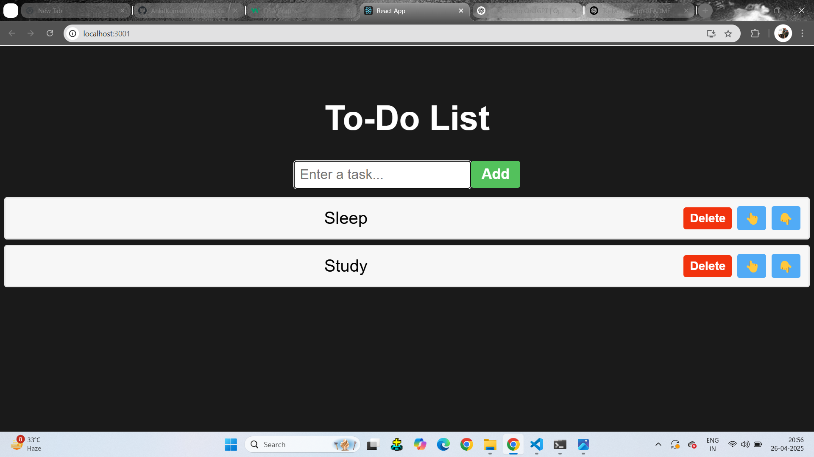
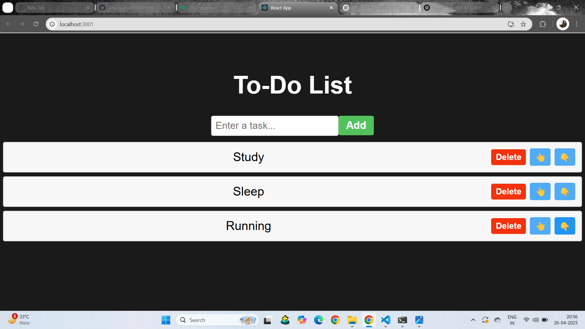

# 📝 To-Do List App

A sleek and user-friendly To-Do List App built with **React**. This project is designed to help users stay organized and boost productivity with a minimalist and efficient task management experience.A To-Do List App is a task management tool that helps users organize, prioritize, and track tasks efficiently. It serves as a digital checklist where users can write down what they need to do, set deadlines, and mark tasks as completed once they're done.

## 🚀 Features

- ✅ Add, edit, and delete tasks
- 🗂️ Mark tasks as completed or active
- 🔍 Filter tasks by status (All / Active / Completed)
- 🖼️ Attach images to tasks *(optional enhancement)*
- 💾 Local storage support for persistent data
- 🧑‍💻 Built with React and modern JavaScript (ES6+)

---

## 🖼️ App Preview

📦 Tech Stack
Frontend: React, HTML5, CSS3

State Management: React Hooks (useState, useEffect)

Backend integration for multi-device sync

🤝 Contributing
Contributions, issues and feature requests are welcome!
Feel free to check the issues page or submit a pull request.

🙌 Acknowledgements
Thanks to the open-source community and the React ecosystem for providing powerful tools to build this app.

---

## 🌟 Key Features

- ➕ Add, edit, and remove tasks
- ✅ Mark tasks as complete/incomplete
- 🧩 Filter tasks by status (All / Active / Completed)
- 🖼️ Optional image attachment support for each task
- 💾 Persistent data with local storage
- 📱 Responsive design for all screen sizes
- ⚛️ Built entirely with React functional components and hooks

---

## 🖼️ Screenshots

> Add real screenshots or GIFs below to showcase the UI and user experience. Replace the placeholder links with your own images.

### 💻 Image View
(./todolist/src/assestsi/images/todolist2.png)

### 🖼️ Task with Image

---

## 🚀 Getting Started

🧠 Technologies Used
Frontend: React, JavaScript (ES6+), HTML5, CSS3
State Management: React Hooks (useState, useEffect)
Tooling: Create React App

